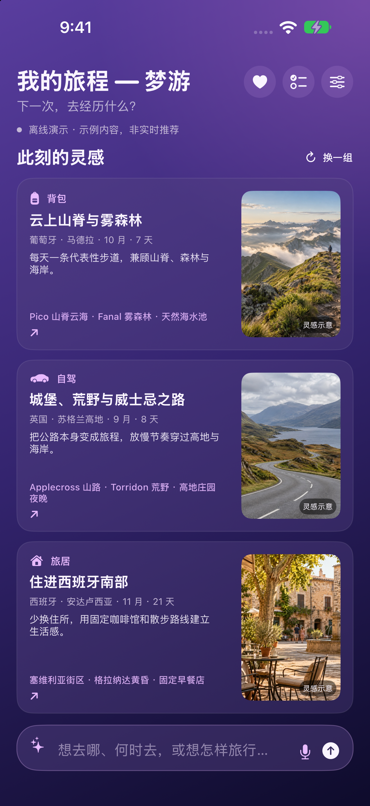
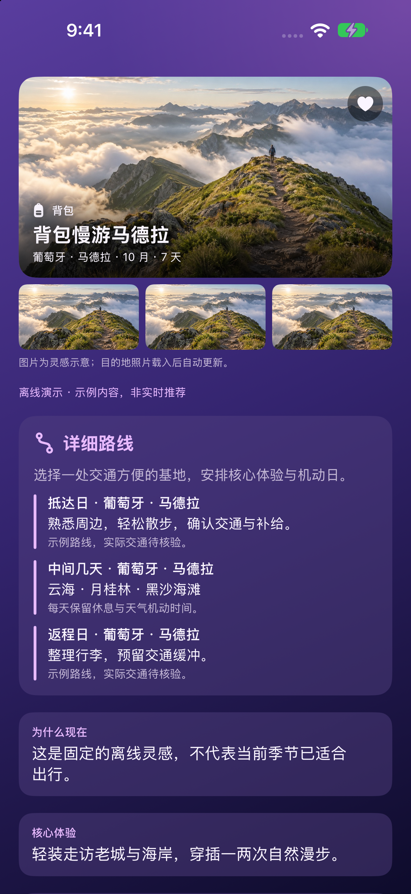
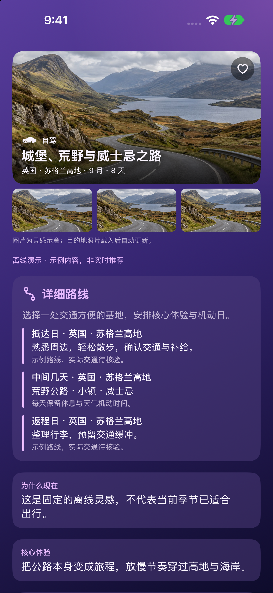
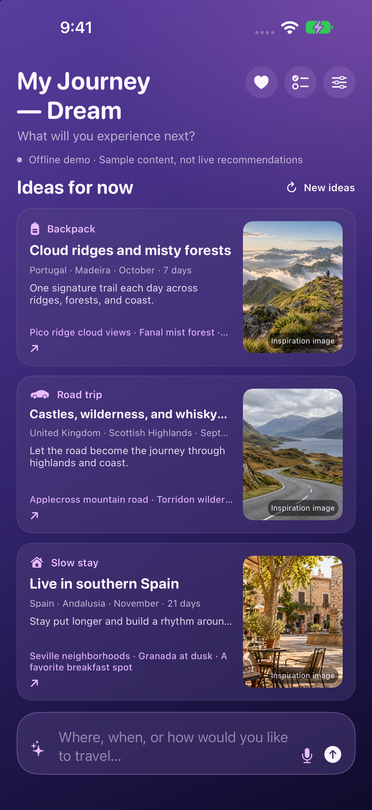
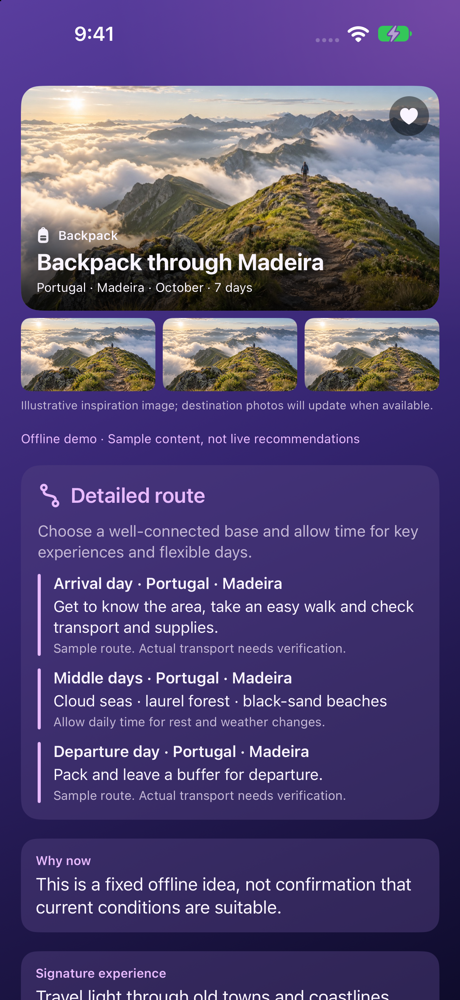
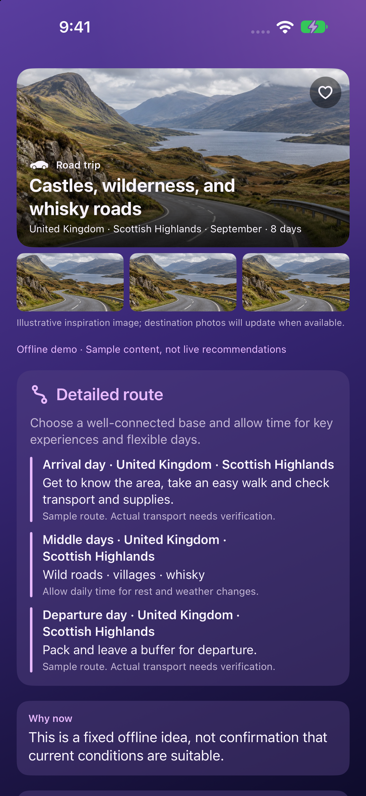

# My Journey Dream

**我在旅途-梦游 · iPhone 公开版 / Public edition**

不是再给一张热门目的地榜单，而是寻找下一次值得专门去经历的背包、自驾或旅居旅程。

Go beyond popular destination lists to discover backpack journeys, road trips, and slow stays worth traveling for.

[支持与用法 / Support](https://wliao78.github.io/My-Journey-Support/#support) · [中文隐私政策](https://wliao78.github.io/My-Journey-Support/#privacy-zh) · [Privacy policy](https://wliao78.github.io/My-Journey-Support/#privacy-en) · [反馈 / Issues](https://github.com/wliao78/My-Journey-Dream-Public/issues)

## 发行状态

版本 1.0 已于 2026 年 10 月 3 日提交 Apple 审核，当时状态为 **Waiting for Review**，设置为审核通过后免费自动发布。这是提交时的记录，不代表已获批准或已经上架。

[App Store 预留链接](https://apps.apple.com/app/id6818731705)：审核通过并发布后可用；发布前可能无法打开。最新审核状态需以 App Store Connect 为准。

[发行记录](AppStore/SubmissionStatus.txt) · [中英文商店文案](AppStore/metadata/) · [全部界面截图](AppStore/screenshots/) · [应用图标](MyJourneyDream/Assets.xcassets/AppIcon.appiconset/AppIcon-1024.png)

## 主要功能

- 首页三类灵感：背包、自驾和旅居。
- 以地点、季节、天数和体验为单位呈现旅行方向。
- 用文字或语音输入旅行要求，也可输入已确定的目的地和时间。
- 快速、中度、深度三档研究，显示耗时，可随时停止；服务商返回时显示 token 用量。
- 同时说明吸引力、季节限制、到达负担与需要接受的取舍。

## 中文界面

| 三种旅行灵感 | 背包详情 | 自驾详情 |
| --- | --- | --- |
|  |  |  |

截图来自实际应用的离线演示模式。演示内容和示意图片用于展示功能，不代表真实预订、实时推荐或已完成事实核实。

## 开始使用

1. 首次打开先看三张有示意图片的离线演示推荐，不自动消耗 AI 费用。
2. 配置 AI 服务商、自己的密钥并同意数据共享后，关闭演示模式。
3. 选择思考程度并开始推荐，或输入例如“十月，十天，从洛杉矶出发，不想太冷”的要求。

## AI 服务与隐私

支持 OpenAI、Anthropic Claude、Google Gemini，以及 DeepSeek、通义千问、Kimi、智谱 GLM、豆包和文心。请使用你自己的 API Key；不同服务商、模型的文字或图像能力可能不同，API 费用由服务商收取，不包含在免费下载中。

AI 功能需要先明确同意数据共享。相关文字、照片或请求信息会发送给所选服务商；密钥保存在本机钥匙串。演示模式无需密钥。仓库不包含私人版 Git 历史、API 密钥或个人旅行资料。

演示旅程不是实时核实的建议，AI 研究也不是预订服务。天气、路线、安全、入境和价格必须在出行前向官方或供应商核实。

## English overview

- Three inspiration modes: Backpack, Road trip, and Slow stay.
- Journey ideas built around place, season, duration, and experience.
- Text or voice requests for travel preferences or an already confirmed destination and dates.
- Quick, Balanced, and Deep research with elapsed time and a stop control; token usage appears when returned by the provider.
- Context on appeal, seasonality, access, and tradeoffs.

| Three journey modes | Backpack details | Road trip details |
| --- | --- | --- |
|  |  |  |

These are actual app screenshots in offline demo mode. Sample data and illustrative images are not live recommendations, real bookings, or verified travel advice.

### Getting started

1. Start with three illustrated offline demo ideas without an automatic AI charge.
2. Configure your provider and key, accept data sharing, and turn off demo mode.
3. Choose a research depth and start, or describe a request such as “Ten days in October, departing Los Angeles, somewhere not too cold.”

Optional AI features use your own key for OpenAI, Claude, Gemini, DeepSeek, Qwen, Kimi, GLM, Doubao, or ERNIE. Provider and model capabilities vary. Explicit data-sharing consent is required, and your chosen provider may charge for API usage. Keys are stored in the device Keychain. Verify important travel information with original documents, venues, and official sources.

Version 1.0 was submitted for Apple review on October 3, 2026, with free automatic release after approval. [App Store link](https://apps.apple.com/app/id6818731705) is reserved for release and may not resolve beforehand. Submission is not approval or availability.

## 开发与设备支持

使用 Xcode 打开 `My Journey Dream.xcodeproj`，选择 `My Journey Dream` scheme。本机安装需使用自己的开发者签名配置。

Swift 6 项目，最低 iOS 18.0，面向竖屏 iPhone。简体中文和英文界面随系统语言切换；此独立公开版不含私人版的历史或个人资源。

Open `My Journey Dream.xcodeproj` in Xcode and select the matching scheme. Use your own development signing settings for device installation. Requires iOS 18.0 or later; designed for portrait iPhone use with English and Simplified Chinese localization.

## My Journey 系列

| App | 用途 / Purpose |
| --- | --- |
| [我在旅途-行程规划 / My Journey Plan](https://github.com/wliao78/My-Journey-Plan-Public) | 安排与准备 / Itinerary and preparation |
| [我在旅途-吃喝指南 / My Journey Food](https://github.com/wliao78/My-Journey-Food-Public) | 附近吃喝 / Nearby food |
| [我在旅途-玩乐 / My Journey Sight](https://github.com/wliao78/My-Journey-Sight-Public) | 发现与讲解 / Discovery and explanations |
| [我在旅途-梦游 / My Journey Dream](https://github.com/wliao78/My-Journey-Dream-Public) | 旅行灵感 / Journey inspiration |

[项目支持](https://wliao78.github.io/My-Journey-Support/#support) · [联系 / Contact](mailto:tinyworm@gmail.com)
